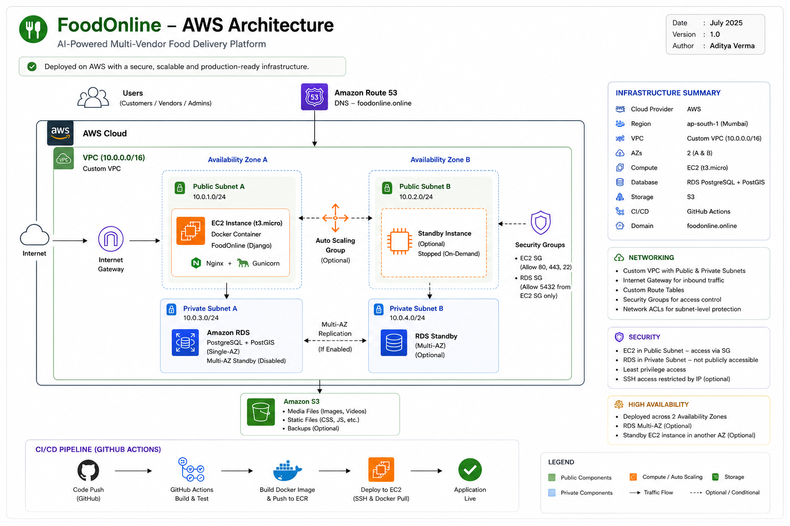

# FoodOnline

A multi-vendor food delivery marketplace with geospatial restaurant discovery, a custom AI chatbot, and a self-managed AWS deployment.

**Live:** [foodonline.online](https://foodonline.online)
**Author:** [Aditya Verma](https://github.com/kr-aditya18)

---

## Overview

FoodOnline is a Django marketplace where customers order from multiple vendors in one checkout, with location-based restaurant discovery and a built-in AI assistant. It is deployed on AWS infrastructure designed and provisioned from scratch: a custom VPC, isolated database subnet, containerized app server, and an automated CI/CD pipeline.

## Architecture



- Custom VPC (`ap-south-1`) with public and private subnets
- EC2 running the Dockerized Django app behind Nginx, SSL via Let's Encrypt
- RDS PostgreSQL/PostGIS in a private subnet, reachable only from EC2
- S3 for media storage via a scoped IAM user
- GitHub Actions builds and deploys on every push to `main`

## Features

**Customer**
- Geospatial restaurant discovery, sorted by distance (PostGIS)
- Multi-vendor cart with split checkout
- Razorpay / PayPal payments
- Live order tracking and photo reviews

**Vendor**
- Admin-approved onboarding
- Revenue and order analytics
- Menu builder with opening-hours validation
- AI-assisted listing generation from a short description

**AI Chatbot**
- Built without a third-party chatbot SDK
- Mood-based recommendations, conversational order tracking and reorder
- Vendor-side competitor price comparison
- Database-backed rate limiting, no Redis dependency

## Tech Stack

| Layer | Technology |
|---|---|
| Backend | Django 6, GeoDjango |
| Database | PostgreSQL + PostGIS (AWS RDS) |
| Infrastructure | AWS (EC2, RDS, S3, VPC, IAM), Docker, Nginx |
| CI/CD | GitHub Actions |
| AI / LLM | OpenRouter API (5-model fallback chain) |
| Payments | Razorpay, PayPal Sandbox |
| Frontend | Vanilla JS, Web Speech API |

## Engineering Notes

- **Silent S3 upload failure:** Django 4.2+'s `STORAGES` setting silently overrode `DEFAULT_FILE_STORAGE`, so uploads wrote to the container's local disk and were lost on redeploy with no errors raised. Found by testing `boto3` directly.
- **Port unreachable externally:** security group rules were correct, but the app was still unreachable outside EC2. Root cause was the ISP throttling non-standard ports; resolved by routing through Nginx on 80/443.
- **Nginx multi-domain conflict:** overlapping `server_name` blocks from multi-domain Certbot caused silent 404s on the bare IP. Resolved by consolidating routing config.

## Local Setup

```bash
git clone https://github.com/kr-aditya18/foodonline.git
cd foodonline
python -m venv env && source env/bin/activate  # Windows: env\Scripts\activate
pip install -r requirements.txt
```

Create a `.env` file with your database, AWS, and API credentials (see `.env.example` if available), then:

```bash
python manage.py migrate
python manage.py createsuperuser
python manage.py runserver
```

Requires PostgreSQL with the PostGIS extension enabled locally. Visit `http://127.0.0.1:8000`.

---

Built by [Aditya Verma](https://github.com/kr-aditya18)
